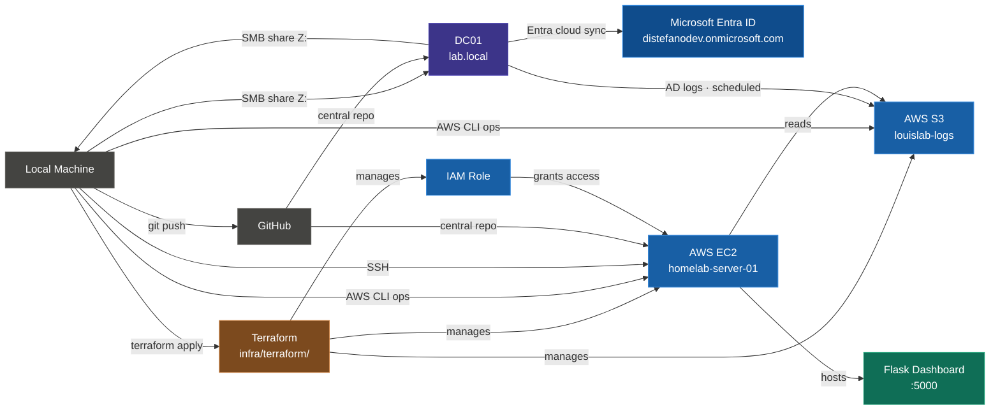
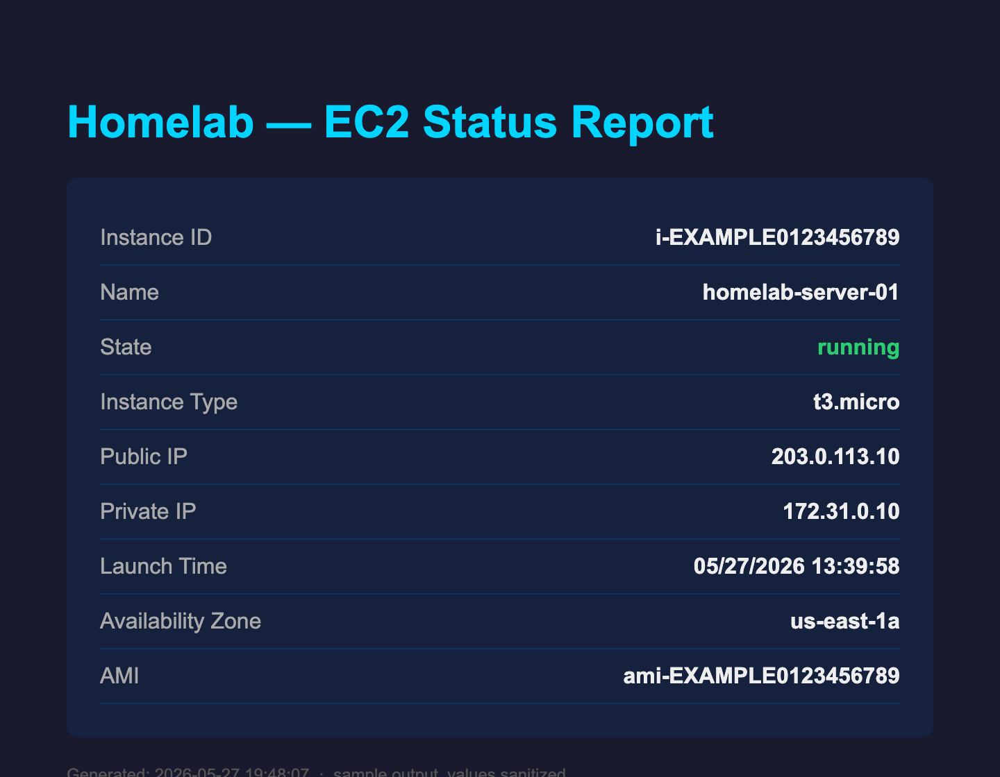
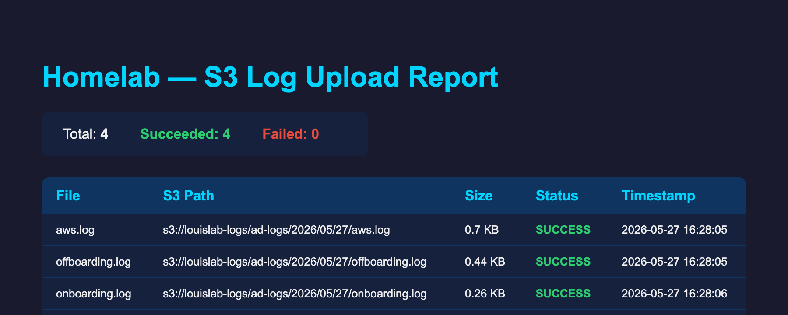
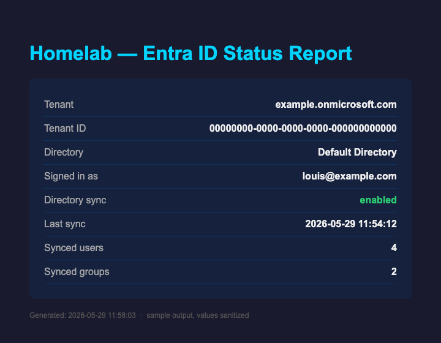
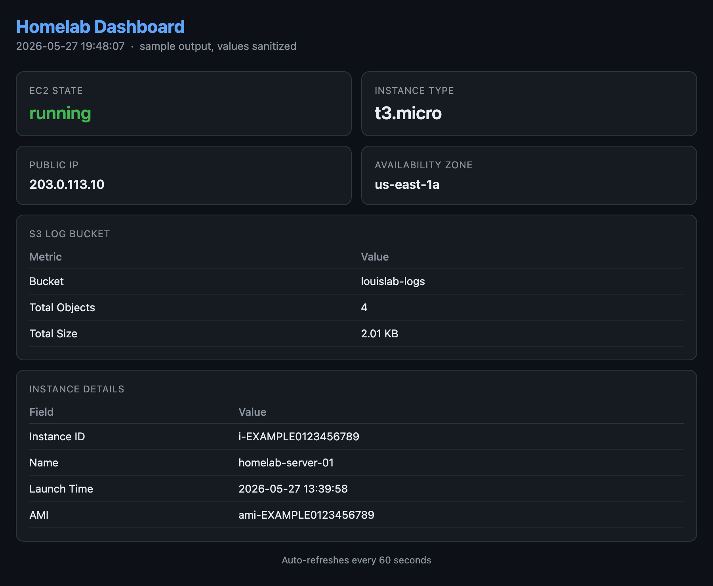

# Homelab — Louis Distefano

A hybrid Active Directory and AWS lab. It handles accounts in AD, syncs the directory up to Microsoft Entra ID, ships the logs to S3 on a schedule, and has a small dashboard for keeping an eye on it.

_Last updated: June 2026_

---

## Start here

This is a small enterprise-style environment I built and run end to end. Three parts: identity in Active Directory (extended to the cloud with Microsoft Entra ID), the AWS layer defined in Terraform, and the PowerShell and Python that automate and monitor it all. Most of it can't run without my domain and AWS account, but it's all real code, and the [`docs/samples/`](docs/samples/) folder shows what it actually produces.

Where to look:

| Topic | File |
|---|---|
| The big picture | [Architecture diagram](#architecture-diagram) and routing table below |
| What it produces | [`docs/samples/`](docs/samples/) — dashboard and reports, rendered |
| Why I built it this way | [`docs/BUILD-NOTES.md`](docs/BUILD-NOTES.md) |
| AD automation | [`ad/scripts/`](ad/scripts/) — onboard/offboard in PowerShell |
| Hybrid identity | [`azure/scripts/`](azure/scripts/) — Entra sync status in PowerShell |
| Infrastructure as code | [`infra/terraform/`](infra/terraform/) and its [README](infra/terraform/README.md) |
| The monitoring app | [`monitoring/dashboards/app.py`](monitoring/dashboards/app.py) |
| What you can run yourself | [Running this yourself](#running-this-yourself) |

---

## Architecture

| Layer | Technology | Purpose |
|-------|-----------|---------|
| Layer 1 | Windows Server 2022 + Active Directory, Microsoft Entra ID | Identity (on-prem + cloud, synced) |
| Layer 2 | AWS (EC2, IAM, S3), Terraform | Cloud Infrastructure & IaC |
| Layer 3 | PowerShell, Python, Flask, Gunicorn | Automation & Monitoring |

## Architecture Diagram



| From | To | What | Why |
|------|----|------|-----|
| Local Machine | GitHub | `git push` | Central repository for all scripts, config, and documentation |
| Local Machine | DC01 | SMB share Z: (bidirectional) | Move scripts to VM, pull logs and files back to local |
| DC01 | Microsoft Entra ID | Entra Cloud Sync agent | Sync the on-prem `LAB` OU (users, groups, service accounts) up to the cloud, so it's one identity on-prem and in Entra |
| Local Machine | AWS (via Terraform) | `terraform apply` | Declarative lifecycle management of S3, EC2, security group, IAM role/profile/policies |
| Local Machine | AWS (via CLI) | AWS CLI ad-hoc ops | Day-to-day operations: EC2 status queries, S3 log uploads, bucket inspection |
| Local Machine | AWS EC2 | SSH | Direct server access for administration and deployments |
| DC01 | AWS S3 | AD logs shipped daily (scheduled) | Audit trail and compliance simulation |
| IAM Role | AWS EC2 | Grants read-only access to EC2 + S3 | No hardcoded credentials on the server |
| AWS EC2 | AWS S3 | Reads log bucket stats | Dashboard displays live object count and total size |
| AWS EC2 | Flask Dashboard | Hosts the app via gunicorn | Live monitoring accessible from any device via browser |

> Build order, the reasoning behind each layer, and the things I left unhardened on purpose are in [`docs/BUILD-NOTES.md`](docs/BUILD-NOTES.md).

---

## Layer 1 — Active Directory

**Domain:** `lab.local`  
**Domain Controller:** `DC01.lab.local`  
**Platform:** Windows Server 2022 (VM via UTM on Apple Silicon)

### OU Structure
```
lab.local
└── LAB
    ├── Users
    ├── Groups
    ├── Computers
    ├── Service Accounts
    └── Disabled
```

### Groups
| Group | Type | Members |
|-------|------|---------|
| IT Admins | Global Security | mike.chen |
| Portfolio Managers | Global Security | john.smith |

### Users
| Username | Title | OU |
|----------|-------|----|
| john.smith | Portfolio Manager | LAB\Users |
| sarah.jones | Compliance Officer | LAB\Users |
| mike.chen | IT Administrator | LAB\Users |
| svc.backup | Backup Service Account | LAB\Service Accounts |

### Entra ID hybrid identity

The on-prem directory doesn't stop at the domain controller. **Microsoft Entra Cloud Sync** pushes the whole `LAB` OU tree (users, groups, and service accounts) up to a cloud tenant (`distefanodev.onmicrosoft.com`), so the objects I manage in `lab.local` show up in Entra as the same identities. AD stays the source of truth; sync is one-way, AD up to Entra. That's the hybrid part.

| Detail | Value |
|--------|-------|
| Tenant | `distefanodev.onmicrosoft.com` |
| Sync engine | Entra Cloud Sync (lightweight provisioning agent on DC01) |
| Scope | The whole `LAB` OU tree (users, groups, and service accounts) |
| Cloud identity | `firstname.lastname@distefanodev.onmicrosoft.com` (routable UPN suffix added in AD; `@lab.local` isn't routable) |
| Direction | One-way: AD is the source of truth, changes flow up to Entra |
| Password hash sync | On, so the same password works on-prem and in Entra |
| Licensing | Entra ID Free tier |

I went with **Cloud Sync rather than the full Entra Connect** engine on purpose: DC01 is a single domain controller on an Apple Silicon VM, Cloud Sync is the lighter agent with its config managed from the portal, and the free tier covers everything this lab needs. The reasoning is in [`docs/BUILD-NOTES.md`](docs/BUILD-NOTES.md).

---

## Layer 2 — AWS

**Account:** IAM user `louis-admin` (MFA enabled, root account locked down)  
**Region:** us-east-1

### Resources
| Resource | Name | Purpose |
|----------|------|---------|
| S3 Bucket | louislab-logs | Log archival |
| EC2 Instance | homelab-server-01 | Cloud server (Amazon Linux 2023, t3.micro) |
| IAM Role | homelab-ec2-role | EC2 read-only access to EC2 + S3 |

### Security
- Root account MFA enabled
- Day-to-day access via IAM user with AdministratorAccess
- EC2 SSH accessible via key pair authentication only, no password access
- No credentials stored on EC2; the IAM role is used instead

### Infrastructure as Code
The AWS layer lives in Terraform under [infra/terraform/](infra/terraform/): the S3 bucket, EC2 instance, security group, IAM role, two policy attachments, and the instance profile. Seven resources, all imported from the live environment with Terraform 1.5+ `import` blocks rather than rebuilt from scratch.

Every managed resource gets `Project=homelab`, `ManagedBy=terraform`, and `Owner=louis` as default tags, which makes it easy to tell in the console what Terraform owns and what I set up by hand.

| Command | Purpose |
|---------|---------|
| `terraform plan` | Diff between the code and live AWS. Read-only. |
| `terraform apply` | Make AWS match the code |
| `terraform output` | Print bucket name, EC2 public IP/DNS, role ARN |

The [Terraform README](infra/terraform/README.md) has the module map and the import history.

---

## Layer 3 — Automation & Monitoring

### AD Automation Scripts
| Script | Description |
|--------|-------------|
| `ad/scripts/New-LabUser.ps1` | Provisions new AD user with OU placement, group membership, and logging |
| `ad/scripts/Remove-LabUser.ps1` | Offboards AD user: disables account, removes groups, moves to Disabled OU |

### AWS Automation Scripts
| Script | Description |
|--------|-------------|
| `aws/scripts/Get-LabEC2Status.ps1` | Queries EC2 instance status and outputs HTML report |
| `aws/scripts/Send-LabLogsToS3.ps1` | Ships local AD logs to S3 bucket with date-prefixed structure |

### Azure Automation Scripts
| Script | Description |
|--------|-------------|
| `azure/scripts/Get-EntraStatus.ps1` | Reports Entra hybrid-identity status (tenant, last sync time, synced user and group counts) and outputs HTML report |

Sample output, with real IDs, IPs, and tenant details swapped for placeholders:

| EC2 status report | S3 upload report | Entra status report |
|---|---|---|
| [](docs/samples/ec2-status-report.html) | [](docs/samples/s3-upload-report.html) | [](docs/samples/entra-status-report.html) |

### Monitoring Dashboard
- **Flask dashboard** running on `homelab-server-01` via Gunicorn
- Displays live EC2 status, instance details, and S3 bucket stats
- Password protected via HTTP Basic Auth (credentials stored as environment variables)
- Auto-refreshes every 60 seconds
- Mobile accessible

[](docs/samples/dashboard.html)

_[`monitoring/dashboards/app.py`](monitoring/dashboards/app.py) rendered with placeholder values. The live app reads these from AWS through boto3._

---

## Repository Structure
```
homelab/
├── README.md
├── docs/
│   ├── BUILD-NOTES.md      # build order, decisions, trade-offs
│   └── samples/            # sanitized renders of the dashboard & reports
├── ad/
│   └── scripts/
│       ├── New-LabUser.ps1
│       └── Remove-LabUser.ps1
├── aws/
│   └── scripts/
│       ├── Get-LabEC2Status.ps1
│       └── Send-LabLogsToS3.ps1
├── azure/
│   └── scripts/
│       └── Get-EntraStatus.ps1   # Entra hybrid-identity status report
├── infra/
│   └── terraform/          # IaC for the AWS layer (S3, EC2, SG, IAM)
│       ├── README.md
│       ├── main.tf
│       ├── s3.tf
│       ├── ec2.tf
│       ├── iam.tf
│       └── outputs.tf
├── monitoring/
│   └── dashboards/
│       ├── app.py
│       └── requirements.txt
├── logs/          # runtime output, gitignored
└── reports/       # runtime output, gitignored
```

---

## Running this yourself

The live pieces depend on infrastructure that isn't in the repo. Here's what's reproducible and what isn't:

| Layer | Can you run it? |
|-------|-------------------------------|
| AD scripts (`ad/scripts/`) | Need a live `lab.local` domain controller with the AD PowerShell module. Without a domain they won't run, but they're worth reading for the onboarding/offboarding logic. |
| Entra script (`azure/scripts/`) | Needs your own Entra tenant and the Azure CLI signed in (`az login`). The tenant is hardcoded to mine, so point it at yours or read it for the Graph/`az` query pattern. |
| AWS / Terraform (`infra/terraform/`) | Describes my account's resources. Region, IDs, and the AMI are hardcoded and there are no input variables, so `terraform plan` would point at my infra, not yours. Treat it as a reference for the import workflow and layout. |
| Flask dashboard (`monitoring/dashboards/`) | This one runs anywhere. Point it at any AWS account with an instance tagged `homelab-server-01` and a bucket named `louislab-logs`, or change those two values. |

```bash
cd monitoring/dashboards
pip install -r requirements.txt
# boto3 needs AWS creds (an IAM role on EC2, or a local ~/.aws profile)
DASHBOARD_USER=you DASHBOARD_PASS=secret gunicorn -b 0.0.0.0:5000 app:app
```

If you'd rather not set anything up, the [`docs/samples/`](docs/samples/) folder shows what the dashboard and reports look like.